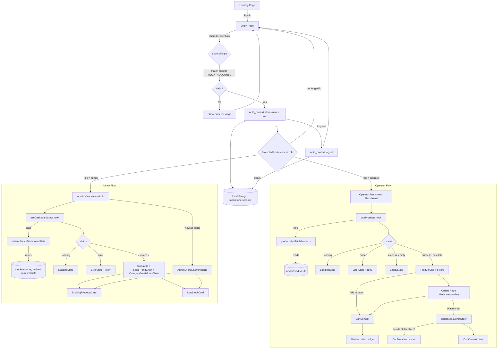

# MarketOne Dashboard

## Tech Stack

- React 19 + TypeScript, via Vite
- Tailwind CSS v4
- React Router v7
- Recharts (admin charts only)

## Getting started

```bash
npm install
npm run dev
```

The app runs at `http://localhost:5173`.

## Demo accounts

| Role   | Email                | Password  |
|--------|----------------------|-----------|
| Client | client@infinitron.al | client123 |
| Admin  | admin@infinitron.al  | admin123  |

## Documentation
[Documentation file](https://github.com/stivengjinaj/marketone/Docs.md)

## Features

### Public
- Landing page

### Operator role
- Product catalog fetched from a (mocked) API, with name, category, price and stock shown per item.
- Search by name and filter by category, combinable.
- Add-to-order flow with a running cart, visible as a badge on the Orders nav link.
- Order summary page: quantity adjustment, line removal, computed total, and order submission.
- Loading, error (with retry), and empty states on both the product list and the order list.
- Responsive layout: card grid collapses from 4 columns down to 1, nav collapses to a mobile menu.

### Admin role
A separate section, reachable only by the admin account, aimed at giving a non-technical owner a
quick operational read:
- Overview page: revenue, order count, active operators and average order value, each with a
  trend indicator.
- 14-day revenue trend chart and a stock-value-by-category breakdown.
- Expiring-stock alerts, flagged by urgency (≤2 days, ≤5 days).
- Low-stock alerts against a fixed threshold.
- A dedicated Alerts page with the full, unclipped lists.
- Sidebar navigation on desktop, slide-over drawer on mobile.

### Cross-cutting
- Role-based route protection: an operator cannot reach `/admin`, an admin is redirected away from
  the operator pages, and an unauthenticated visitor is sent to `/login`.
- All data access goes through `src/api/`, which currently returns mocked data on a short artificial
  delay. Swapping to a real backend means changing the implementation of those functions, not the
  components that call them.

## Project structure

```
src/
  api/          stub API functions + endpoint constants (swap for real HTTP calls later)
  mocks/        seed data used by the API stubs (products, accounts, dashboard stats)
  types/        shared TypeScript types, grouped by domain
  context/      Auth_context, CartContext
  hooks/        useAuth, useCart, useProducts, useDashboardStats
  components/
    ui/         generic building blocks (Button, Badge, Card, states)
    layout/     Navbar, DashboardLayout, Admin sidebar/topbar/drawer/layout
    product/    product filters, card, grid
    order/      cart row, order summary
    admin/      charts and alert cards
  pages/        route-level components
    admin/      admin-only route-level components
  routes/       ProtectedRoute (role guard)
  styles/       global.css (Tailwind entry point)
```

## Architecture notes

- **State**: no external state library.
- **Data fetching**: each domain (`products`, `stats`) has a small hook (`useProducts`,
  `useDashboardStats`) that exposes `status: 'idle' | 'loading' | 'success' | 'error'` plus a
  `reload` function, so loading/error/empty handling is consistent across pages.
- **Roles**: `ProtectedRoute` takes an `allowedRoles` prop and redirects based on the signed-in
  user's role, read from `AuthContext`. There is no real authorization on a backend yet — this is a
  frontend-only simulation of what that gate will look like.

  
